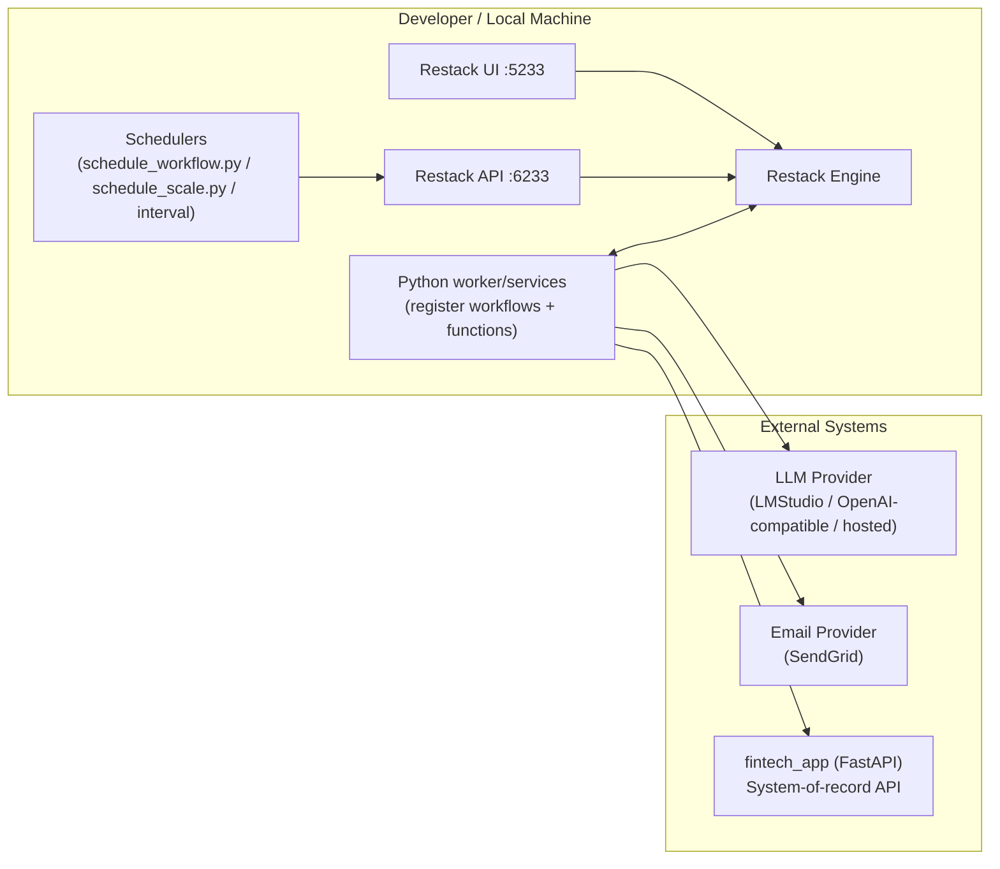
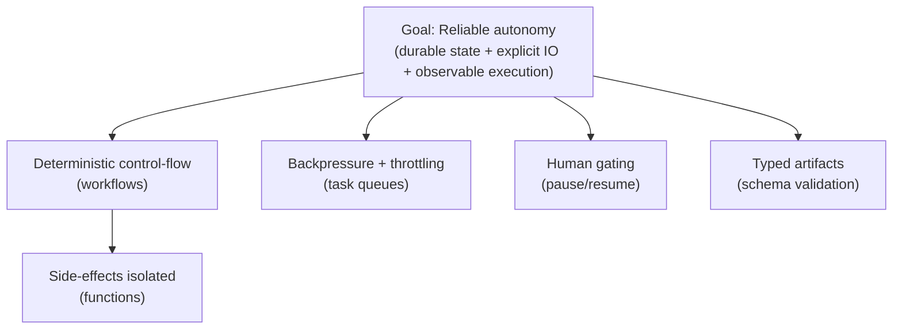
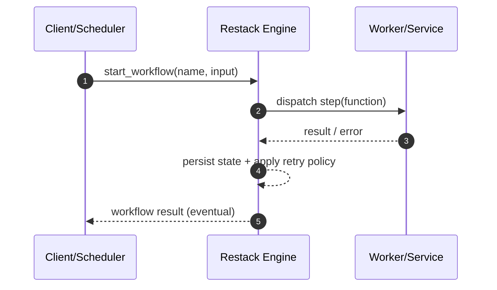
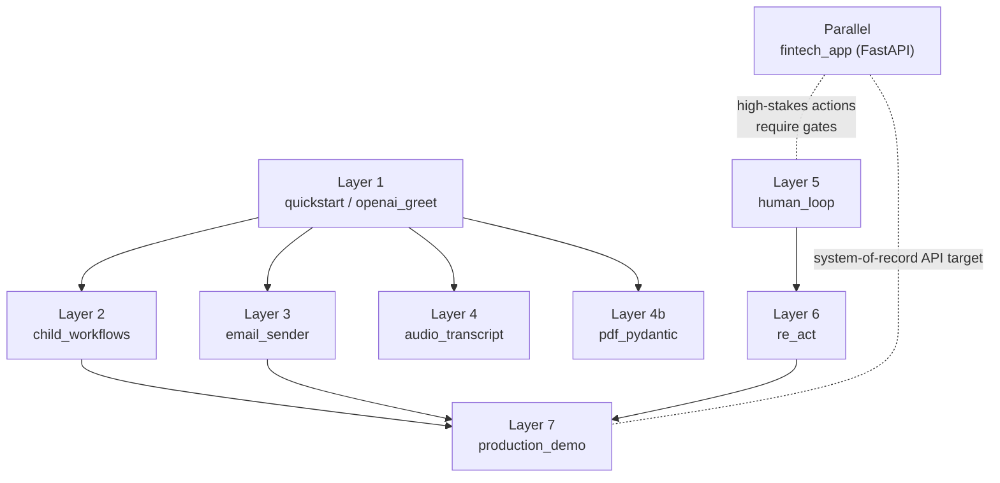
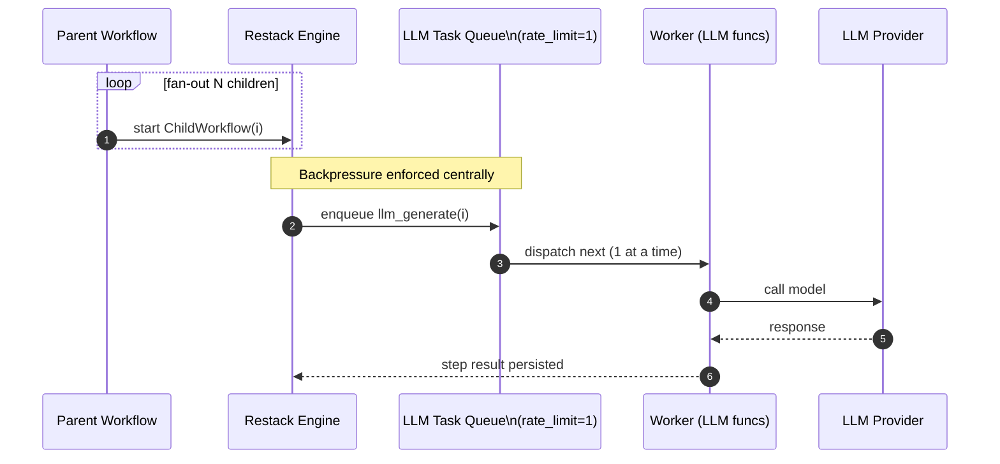
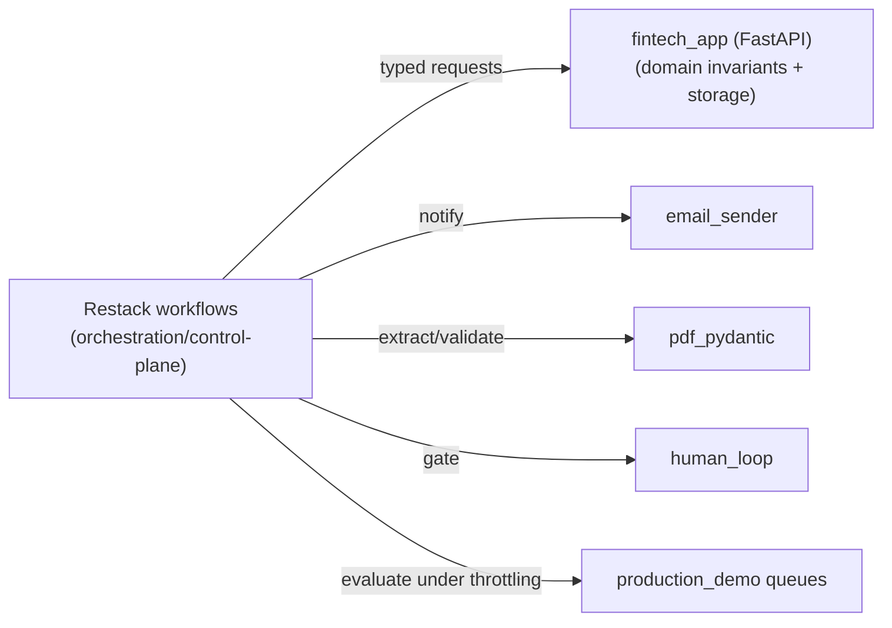

# -autonomousagent (README v3)

> **v3 unifies v1 + v2**: this README replaces the earlier “Restack AI Python Examples” boilerplate (v1) and the repo-specific reframing toward autonomous agents (v2) into a single narrative for first-time readers.

This repository is a **workflow-centric autonomous-agent workbench** built around the **Restack Engine** and the **Restack AI Python SDK**. It is intentionally structured as a **monorepo of runnable examples**—each directory isolates one “agent systems” concern (composition, retries, rate limits, human review, typed IO, external integrations). Together, they form a path from **hello-world workflows → production-grade agent orchestration**.

---

## Visual index (animated + static)

- Static diagrams are embedded inline (Mermaid).
- Optional animated assets live in `docs/diagrams/`:
  - `docs/diagrams/architecture.gif` — overall runtime “movie”
  - `docs/diagrams/fanout.gif` — parent → many children fan-out
  - `docs/diagrams/queue.gif` — rate-limited queue draining visualization
  - `docs/diagrams/retry.gif` — retry/backoff loop
  - `docs/diagrams/human_gate.gif` — approval gate pause/resume

See: [`docs/diagrams/README.md`](docs/diagrams/README.md)

---

## What Restack is (and why it exists): a short story

Modern “AI agents” fail in boring ways:
- rate limits and transient network faults collapse a multi-step plan,
- concurrency causes duplicate actions (double-send, double-charge),
- long-running tasks lose state when a process restarts,
- prompt/tool chains become un-auditable and non-deterministic,
- and teams reinvent queues, retries, cron schedulers, and observability—again and again.

Restack was created to eliminate that systems tax by turning “agent behavior” into **durable workflows**—a formal, inspectable execution model where:
- steps have explicit inputs/outputs,
- side effects are isolated into functions with retry policies,
- execution is persisted (so crashes don’t lose progress),
- and concurrency/rate limits are enforced as *runtime constraints* instead of application-level hacks.




### Who invented Restack?
Restack is built and maintained by the **Restack team** (Restack.io). In this repo, you’ll see the engine distributed as a Docker image (`ghcr.io/restackio/restack:main`) and examples written against their SDK. The canonical provenance lives in their public organization and releases:
- https://github.com/restackio

*(This README intentionally doesn’t speculate beyond what’s verifiable from the engine image + public org; if you want founder-level attribution, add it here with an official source link.)*

### What pain did they solve, and how?
They solved the “agent reliability gap” by combining:
1. **A workflow engine** (durable state + scheduling + history/trace UI)
2. **A function execution layer** (task queues, retries, concurrency controls)
3. **A developer-facing SDK** (define workflows/functions as code; run locally or in cloud)

This architecture matches what distributed-systems literature teaches: reliability emerges when you *model control flow explicitly* and make failure/retry semantics first-class. Conceptually, it aligns with:
- **workflow/Petri-net foundations** (control-flow as a formal model; van der Aalst’s workflow net lineage),
- and **Saga-like long-lived transaction thinking** (decompose into steps with compensation, retries, and audit).

### How did Restack evolve (practically)?
The evolution pattern is typical for orchestration platforms:
- start with “run workflows reliably”,
- add developer ergonomics (SDKs, local dev),
- add observability (UI timelines, step durations, queues),
- add operational controls (rate limits, concurrency, scaling),
- then add deployment pathways (cloud stacks).

You can see that “maturity arc” reflected in this repo: we begin with small examples, then culminate in a scaling-oriented **production demo**.

---

## How that led to what you’re using it for today

You’re using Restack here as an **agent substrate**: not “one chatbot”, but a set of **composable, durable programs** that can:

- fan out into child workflows (hierarchical decomposition),
- call external services safely (email, APIs),
- throttle LLM/tool calls under heavy concurrency,
- route uncertain steps through a human review loop,
- and keep typed, testable artifacts (schemas, validations).



In other words:

> This repository treats “autonomy” as an engineering problem in **orchestration, correctness, and operational semantics**, not a prompt-engineering exercise.

---

## What this repo is (current state)

This repository is organized as a multi-example monorepo. Each top-level directory is effectively a small, runnable project.

The fundamental design pattern is consistent:

- **Workflows** define control flow and state transitions.
- **Functions** implement side-effectful operations (LLM calls, HTTP calls, email).
- **Services/Workers** register those workflows/functions with the engine.
- **Schedulers/Clients** trigger workflows (single-run, burst scale, intervals).



---

## How the examples interlink (the conceptual dependency graph)

Think of the repo as layers; later examples reuse primitives introduced earlier.




### Layer 0 — Runtime substrate (Restack engine + worker)
All Restack-backed examples assume:
- the **Restack Engine** running locally (Docker)
- a **Python service** registering workflows/functions

This layer provides durability, scheduling, retries, queueing, and UI introspection.

### Layer 1 — Minimal workflows (base calculus)
- `quickstart/`, `openai_greet/`

Introduce:
- the minimal workflow lifecycle,
- the workflow/function split,
- and execution observability in the Restack UI.

### Layer 2 — Composition via child workflows
- `child_workflows/`

Adds hierarchical decomposition: parent → child workflows. This is the orchestration primitive that later enables scalable “agent subroutines”.

### Layer 3 — External side effects + failure semantics
- `email_sender/`

A canonical reliability demo: external provider integration plus induced failure to show automatic retries.


### Layer 4 — Pipelines and typed IO
- `audio_transcript/`
- `pdf_pydantic/` (structured extraction/validation)

These illustrate multi-step transforms and schema-bound intermediate artifacts—crucial for testable agent systems.

### Layer 5 — Human-in-the-loop control
- `human_loop/`

Adds supervisory gating (pause/resume, approval flows). This becomes non-optional in regulated or high-stakes domains.


### Layer 6 — Agent loop experiments (ReAct-like)
- `re_act/`

Encodes “reason → act → observe → iterate” as explicit workflow steps, benefiting from retries, queues, and human gates.

### Layer 7 — Production constraints: scaling under rate limits
- `production_demo/`

Demonstrates how to run many workflows concurrently while enforcing strict LLM/tool constraints without bespoke queue infrastructure.

### Parallel track — Domain backend substrate (Fintech)
- `fintech_app/`

A conventional FastAPI backend representing the “system of record” an agent platform would integrate with in real life.

---

## Deep dive: `production_demo/` (why it is the keystone)

**Claim:** “Agentic” systems don’t fail because they can’t reason; they fail because they can’t *operate*.

`production_demo/` shows the operational envelope:

- run **50 workflows** in parallel (burst scheduling),
- each workflow has three steps; steps 2–3 are LLM calls,
- enforce a rate limit (e.g., 1 concurrent call / sec) centrally via the service configuration.




This replaces ad-hoc approaches (Celery queues, semaphores, middleware throttles) with **engine-level scheduling**. The Restack UI then provides per-step queue time, execution time, and retry counts—turning performance and reliability into visible, measurable quantities.

If you want to build an autonomous agent that survives production traffic, this directory is the reference point.

---

## Deep dive: `fintech_app/` (why it belongs in an agent repo)

`fintech_app/` is a backend FastAPI application—i.e., not a workflow demo—yet it is strategically important:

- Fintech is a high-stakes domain with strict correctness/audit constraints.
- It forces you to model idempotency, authorization boundaries, and “source of truth” data.
- It’s the natural target for workflow-driven automation (KYC, reconciliation, fraud triage, dispute workflows).



**How it interlinks:**
- Restack workflows (e.g., human gating + schema validation + notification + rate-limited LLM evaluation) should call into this API rather than mutate state ad hoc.
- This yields a clean separation:
  - **FastAPI = domain state + invariant enforcement**
  - **Restack workflows = orchestration + long-running processes + fault tolerance**

This is the architecture the repo is implicitly converging toward.

---

## Repository map (recommended reading order)

1. `quickstart/` or `openai_greet/` — minimal workflow lifecycle  
2. `child_workflows/` — composition / decomposition  
3. `email_sender/` — side effects + retries  
4. `audio_transcript/` — multi-step pipeline  
5. `pdf_pydantic/` — typed artifacts / structured extraction  
6. `human_loop/` — safe autonomy via human gates  
7. `re_act/` — agent loop experiments  
8. `production_demo/` — scaling + rate limits (production envelope)  
9. `fintech_app/` — domain backend substrate

---

## Running the Restack engine locally

```bash
docker run -d --pull always --name restack \
  -p 5233:5233 -p 6233:6233 -p 7233:7233 \
  ghcr.io/restackio/restack:main
```

UI: http://localhost:5233

Then `cd` into any example directory and follow its README (Poetry-based setup is the norm across the repo).

---

## Notes on provenance (v1 → v2 → v3)

- **README v1** was the upstream-style “Restack AI Python Examples” text and still accurately describes the repo’s *mechanics* (multiple examples, run engine in Docker, follow per-example READMEs).
- **README v2** reframed the repo as an “autonomous agent” workbench and connected the examples into a narrative about durability, composability, and safety.
- **README v3 (this file)** merges both:
  - keeps the operational instructions and multi-example framing,
  - adds the “why” (Restack story + agent reliability thesis),
  - and explains how the fintech + production scale demos anchor the long-term direction.

---

## References (official + foundational)
- Restack organization (official entry point): https://github.com/restackio  
- Restack Engine container used throughout this repo: `ghcr.io/restackio/restack:main` (see example READMEs)

Foundational academic grounding:
- W.M.P. van der Aalst, workflow nets / workflow patterns literature (formal models for workflow control-flow and verification).
- H. Garcia-Molina & K. Salem, **Sagas** (long-lived transactions with fault handling/compensation): “Sagas” (ACM SIGMOD, 1987).
